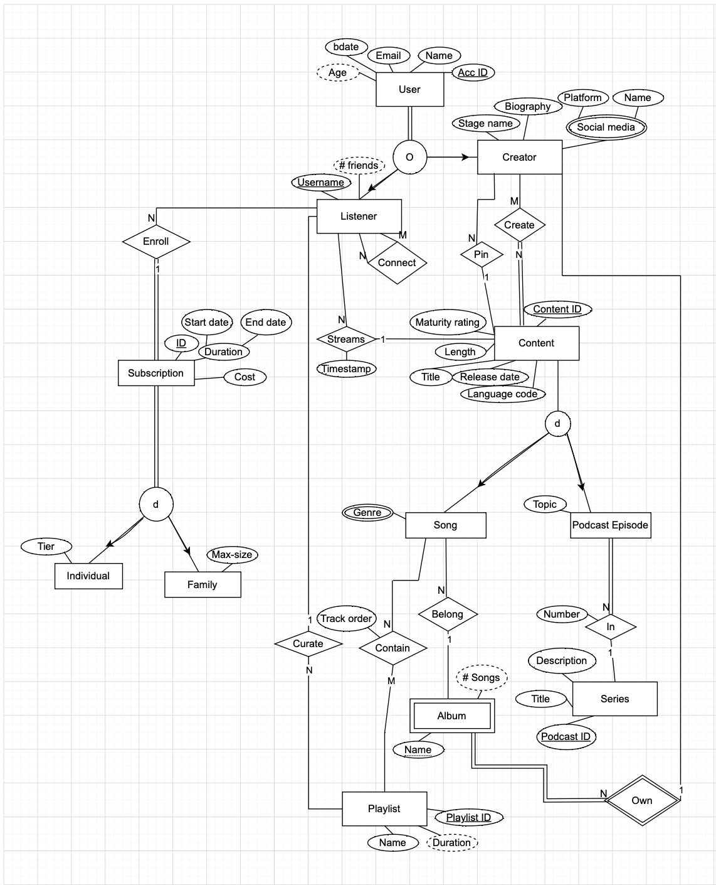

# Media Streaming Service: Database Architecture & Backend Logic

## Overview
This project involves the end-to-end design and implementation of a relational database for a media streaming platform (similar to Spotify/Netflix). The system manages complex interactions between **Users, Creators, Listeners, and Content**

## Technical Highlights
* **Complex Schema:** Architected a relational schema with **20+ tables** including Songs, Podcast Episodes, Albums, and Playlists
* **Data Integrity:** Applied **3rd Normal Form (3NF)** and ER cardinalities ($1:1$, $1:N$, $M:N$) to ensure zero redundancy
* **Automation:** Engineered **SQL Stored Procedures** to automate backend logic, including subscription renewal, content streaming, and social media management

## System Architecture

## Key Mechanisms Implemented
* **Subscription Management:** Automated end-date extensions and family plan validation
* **Content Streaming:** Implemented age-based maturity checks (e.g., users must be 18+ for 'Explicit' content)
* **Playlist Logic:** Designed complex procedures for duplicating, merging, and resequencing playlist track orders
